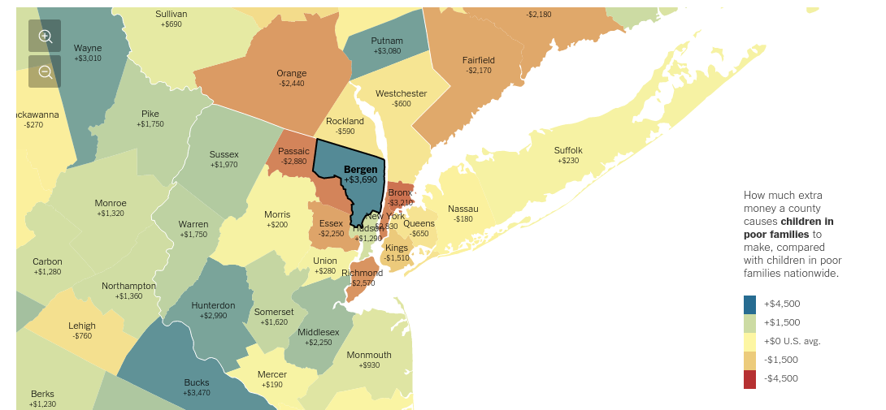
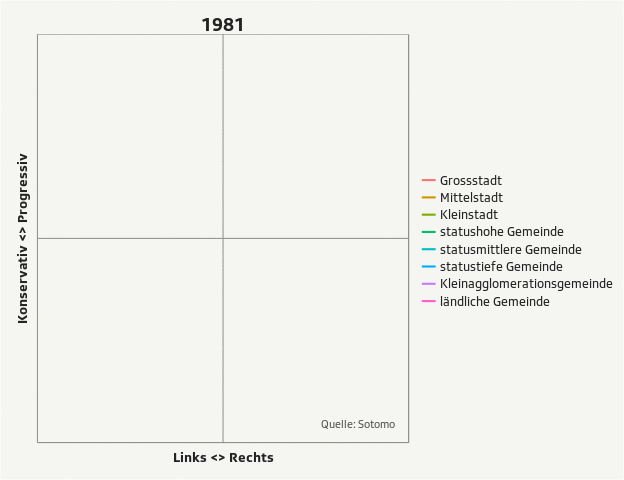

### Zurich R User Group, March 2016
## Data journalism with R

### Experiences at SRF Data

Timo Grossenbacher

[@grssnbchr](http://twitter.com/grssnbchr)

[@srfdata](http://twitter.com/srfdata)

Presentation available under [grssnbchr.github.io/zrug-rddj](http://grssnbchr.github.io/zrug-rddj)


---

### About me

Formerly: MSc in Geography & Computer Science UZH

Mar - Oct 2014: Tages-Anzeiger

Since Nov 2014 I work in the team of SRF Data as **coder** and **journalist** (["journocoder"](https://www.journalism.co.uk/news/recalculating-the-newsroom-the-rise-of-the-journo-coder-/s2/a555646/))


[@grssnbchr](http://twitter.com/grssnbchr)

---

### What the heck is data journalism? 

Some examples

* [NYT: The Best and Worst Places to Grow Up](http://www.nytimes.com/interactive/2015/05/03/upshot/the-best-and-worst-places-to-grow-up-how-your-area-compares.html?abt=0002&abg=0)
* [ProPublica: Dollars for Docs](https://projects.propublica.org/docdollars/)
* [CORRECT!V: Euros für Ärzte](https://correctiv.org/recherchen/euros-fuer-aerzte/datenbank/)



---

### SRF Data


[@srfdata](http://twitter.com/srfdata)

[Portfolio](http://srf.ch/data)

--- 

### SRF Data

.fragment  More: research & ideas, less: service center

.fragment  pitch ideas, receive / collect / scrape / enforce (BGÖ) *data*

.fragment  preprocess > visualize > analyze > find the story

.fragment  publication on [srf.ch](http://srf.ch/data) -> overview, interactivity

.fragment  publication in radio and/or TV -> anecdotes, details, aspects


--- 

### Some examples of our work

.fragment  [Dual-use goods](http://www.srf.ch/news/schweiz/2015-mehr-heikle-exporte-in-den-nahen-osten) & [conventional arms exports](http://www.srf.ch/news/schweiz/schweizer-ruestungsexporte-sind-die-fetten-jahre-vorbei)

.fragment  [The Zurich cantonal police orders a trojan horse](http://www.srf.ch/news/regional/zuerich-schaffhausen/kantonspolizei-zuerich-kauft-umstrittene-schnueffelsoftware)

.fragment  [Covering of the Federal Elections 2015](http://www.srf.ch/news/wahlen-15/wahlkampf/listenverbindungen-daempfen-den-triumph-der-rechten) 


--- 

### What about R? 

.fragment R is a Swiss Army Knife > it reads all kinds of weird s**t

.fragment R allows for automation >  [example](https://twitter.com/search?q=%23wahlch15%20AND%20%40srfdata&src=typd)

.fragment R empowers reproducibility and, ultimately, transparency > [we publish most of our analyses on GitHub](http://srfdata.github.io/)

.fragment [I wrote a blog post about all of this](https://timogrossenbacher.ch/2015/12/why-data-journalists-should-start-using-r-in-2016/)



---

### How *exactly* do we use R? 

`base`, `dplyr`, `tidyr`, `maggritr`, `ggplot2`, `extrafont`, `animation`, `readxl`, `xml2`, `jsonlite`, `RSQLite`, `googlesheets`, `stringr`, `rpremraj/mailR`, `R2HTML`, `knitr`, `slidify`, `readr`, `caret`,  `sp`, `maptools`, etc. 

--- 
### Things I still don't like about R


---

Error reporting in RStudio - in general, the console in RStudio

---

### JSON

The plethora of packages doesn't make it better (`jsonlite`, `rjson`, `RJSONIO`). You still need to use `list()` and complicated `lapply()` calls to produce nested data structures - and JSON is *all about nested data structures*.

What about something like that? 

```{r,eval=F}
my_dataset %>% group_by(facet) %>% to_json("output.json")
```

---

The language... especially [Standard Evaluation vs. Non-Standard Evaluation](https://cran.r-project.org/web/packages/dplyr/vignettes/nse.html) ... and stuff like `paste()` or `paste0()`.

```{r, eval=FALSE}
direct_matches %<>% mutate_(.dots = 
	setNames(
		list(
			interp(~ as.numeric(sub("\\D*(\\d+).*", 
			"\\1", a)), 
			a = as.name(combined))), 
		combined
		)
	)
```

---

## Some resources

[rddj.info - a resource collection for doing DDJ with R](http://rddj.info)

[grssnbchr/rddj-reproducibility-workflow](https://github.com/grssnbchr/rddj-reproducibility-workflow)

[Brian Keegan calls out 538 for openness in #ddj](http://www.brianckeegan.com/2014/04/the-need-for-openness-in-data-journalism/)

---

## The future of (data) journalism?

["Real" interactivity](http://slides.com/drivenbydata/nicar16#/17)

[Sonification](https://soundcloud.com/thisisreveal/oklahomas-man-made-earthquakes)

[Snackable graphics](http://im.ft-static.com/content/images/d823a614-9e82-11e5-b45d-4812f209f861.img)

[Bots and IoT](https://docs.google.com/presentation/d/1X0jrBMHEonEbrj5YzZ0SrDAEgh6KrQzMcF6bj2p8kDY/edit?pref=2&pli=1#slide=id.g3325971d57b349bb_1)

Algorithmic Accountibility

---

# Thank you! 
 
## Questions? 

[@grssnbchr](http://twitter.com/grssnbchr) or timo.grossenbacher(at)srf.ch

[@srfdata](http://twitter.com/srfdata)

This presentation is available (and reproducible) under [github.com/grssnbchr/zrug-rddj](https://github.com/grssnbchr/zrug-rddj/blob/gh-pages/index.md)

<small>Built with the R package [slidify](https://github.com/ramnathv/slidify) and [revealjs](https://github.com/hakimel/reveal.js/)</small>
